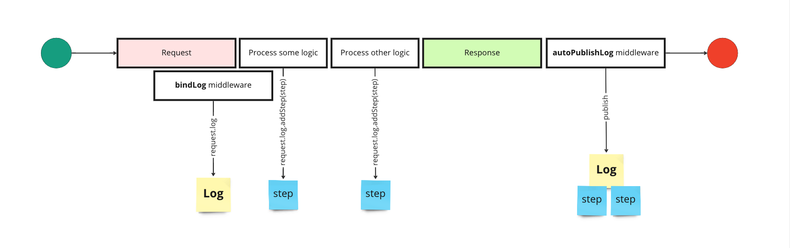

# ts-logs
Understand what happens in your application. Manage your logs and audit the steps of each request.

<a href="https://www.npmjs.com/package/ts-logs" rel="nofollow" class="keychainify-checked">
 
</a>
<a href="https://www.npmjs.com/package/ts-logs" rel="nofollow" class="keychainify-checked">
 
</a>
<a href="https://www.npmjs.com/package/ts-logs" rel="nofollow" class="keychainify-checked">
 
</a>
<a href="https://www.npmjs.com/package/ts-logs" rel="nofollow" class="keychainify-checked">
 
</a>
<a href="https://www.npmjs.com/package/ts-logs" rel="nofollow" class="keychainify-checked">
 
</a>
<a href="https://www.npmjs.com/package/ts-logs" rel="nofollow" class="keychainify-checked">
 
</a>
<a href="https://www.npmjs.com/package/ts-logs" rel="nofollow" class="keychainify-checked">
 
</a>
<a href="https://www.npmjs.com/package/ts-logs" rel="nofollow" class="keychainify-checked">
 
</a>
<a href="https://github.com/4lessandrodev/ts-logs?branch=main" rel="nofollow" class="keychainify-checked">
 
</a>

---

## About the lib

This package provide a sdk to manage logs.

---

## Installation

install using yarn or npm

```sh

$ npm install ts-logs

# OR

$ yarn add ts-logs

```

---
## Documentation

sdk in beta version.

Example

```ts
import { Log, Step } from 'ts-logs';

// create a global log
const global = Log.init({ name: 'First Log', origin: 'https://global.com' });

// create steps
const info = Step.info({ message: 'Fetching api...', name: 'Request Login', method: 'POST' });
const error = Step.error({ message: 'Timeout', name: 'Login', stack: 'Error stack' });

// add steps to global log
global.addSteps([ info, error ]);

// print or save logs
global.print();
global.writeLocal();
global.publish(config);

```

---

### Create step from catch block

Create a step instance from error. This method get many important information from axios error.

```ts

class DoSomething {
    async execute(data: Data): Promise<void> {
        try {
            
            // try do something ...
            await axios.post(url, data);

        } catch(error) {

            // create step instance from error
            return Step.catch(error);
        }
    }
}

```

---

### Log object

Example generated log. The log is a json object with array of step object 

```json

{
  "uid": "1c7e5aca-c9f4-4e33-a5e7-d8a9cfe94053",
  "name": "Log Example",
  "ip": "127.0.0.1",
  "origin": "http://127.0.0.1:3000",
  "createdAt": "2023-02-05T23:00:40.481Z",
  "stateType": "stateful",
  "steps": [
    {
      "name": "Find Item",
      "tags": ["item", "product", "card"],
      "url": "https://my-app.com/products/1",
      "stack": "none",
      "data": "none",
      "statusCode": 200,
      "message": "Fetching api...",
      "type": "info",
      "method": "GET",
      "createdAt": "2023-02-05T23:00:40.481Z",
      "uid": "673e17fb-55aa-4ea9-8668-e34b94bfd22c",
      "additionalInfo": "a complementary information"
    }
  ]
}

```

---

### Use as middleware

Express middleware to capture app errors.

```ts

import express from 'express';
import { stackLog } from 'ts-logs';

const app = express();
app.use(express.json());

// ...
app.use(routes);

// last middleware to handle errors using `stackLog` all errors will be intercepted.
app.use(stackLog({ writeLocal: true })); // <------ middleware

app.liste(3000);

```

### Bind

You also may use bind middleware to apply a log instance to request

```ts

import express from 'express';
import { bindLog, Config } from 'ts-logs';

const app = express();
app.use(express.json());

// on top of routes you can bind a log instance to request
app.use(bindLog()); // <------ middleware

app.get("/log", async (req: Request, res: Response) => {

    // you can do anything with log instance from request.
    req.log.addStep( /* any step */ );
    req.log.print(); // show steps on terminal
    await req.log.publish(Config.S3(/* ... */)) // publish to s3

    res.status(200).json(req.log);
});

// ...

app.use(routes);

```

---

### Use as middleware step

if you use many steps as middleware you can use global log

```ts

import express from 'express';
import { bindLog, Config } from 'ts-logs';

const app = express();
app.use(express.json());

// on top of routes you can bind a log instance to request
app.use(bindLog()); // <------ middleware

app.get("/process", (req: Request, res: Response, next: NextFunction) => {

    // you can do anything with log instance
    req.log.addStep( /* info step */ ); // <------ add step to global log state.

    // call next step
    next();
}, (req: Request, res: Response, next: NextFunction) => {

    // you can do anything with log instance
    req.log.addStep( /* error step */ ); // <------ add step to global log state.

    // call next step
    next();
}, async (req: Request, res: Response, next: NextFunction) => {

    // you can do anything with log instance
    req.log.addStep( /* stack step */ ); // <------ add step to global log state.

    // publish log with steps to aws s3
    await req.log.publish(Config.S3(/* ... */));

    // send log to client
    res.status(200).json(req.log);
});

// ...

app.use(routes);

```

---

### Publish log automatically

you can use in conjunction with binding middleware other middleware to automatically publish logs to your preferred provider.

```ts

import express from 'express';
import { bindLog, autoPublishLog, Config } from 'ts-logs';

const app = express();
app.use(express.json());

// on top of routes you can bind a log instance to request
app.use(bindLog()); // <------ middleware

// after `bindLog` add `autoPublishLog` to automatically publish logs
app.use(autoPublishLog(Config.S3())); // <------ middleware

app.get("/log", async (req: Request, res: Response) => {

    // you can do anything with log instance from request.
    req.log.addStep( /* any step */ ); // <------ add step to publish

    res.status(200).json(req.log);
});

// ...

app.use(routes);

```

---

### Secure logs

It is possible to remove any key from body (data) or encrypt some sensitive information

#### Removing data

```ts

const name = "Step Test";
const data = JSON.stringify({ password: "123456", name: "Jane" });

const step = Step.create({ name, data });

const updated = step.remove(["password"]);

console.log(updated.data);

> "{ \"name\": \"Jane\" }"

// or encrypt attribute

step.encrypt({ attributes: ["password"], secretKey: "my-secret-key" });

```

#### Hidden Value - Mask
you can mask any key value in step data. provide the key name you want or the path. example `user.password` for specific key in user object or `password` for any key called password

```ts

const name = 'sample';

const data = { 
  info: 'secret-text', 
  user: { 
    name: 'Jane',
    password: '12345'
  }
};

const step = Step.create({ name, data });

const updated = step.mask([ { key: 'password' } ]);

console.log(updated);
{
  info: 'secret-text', 
  user: { 
    name: 'Jane',
    password: '*****'
  } 
}

```


#### Encrypt data

Encryption is also available for `stackLog` and as cypher.


```ts

app.use(
  stackLog({ 
    writeLocal: true, 
    encrypt: true, 
    encryptOption: { 
      level: "cypher",
      secretKey: "my-secret-key"
    } 
  })
);

```

---

### Flows

Flows using middleware

Using `bindLog` combined with `autoPublishLog` middleware



Using `bindLog` combined with `stackLog` middleware


